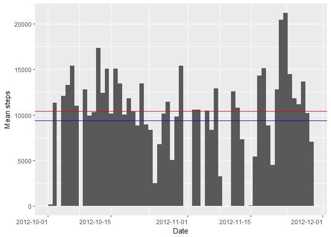
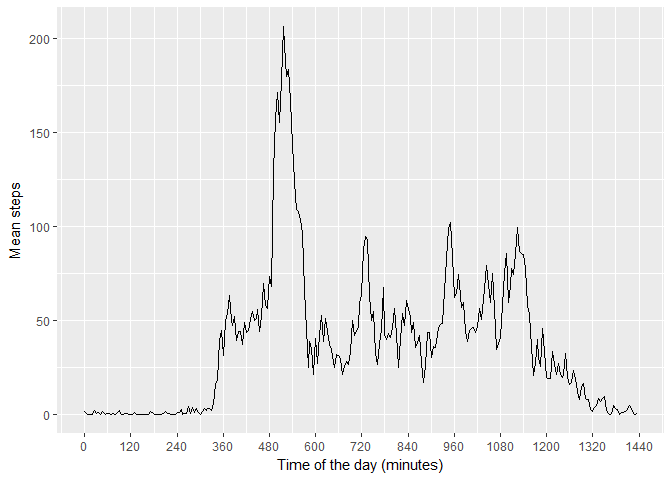
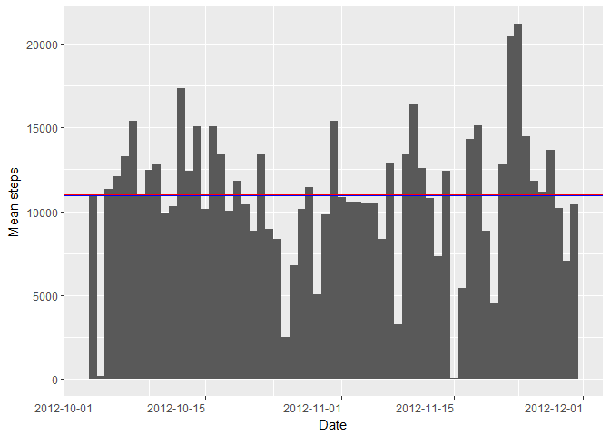
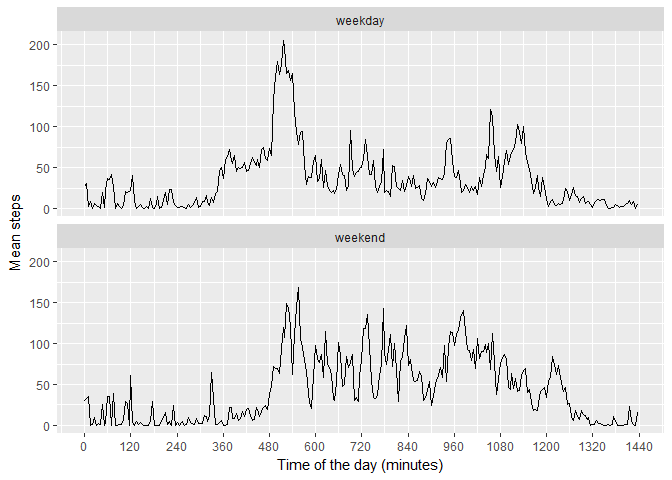

# Reproducible Research: Peer Assessment 1


## Loading and preprocessing the data
All dependencies are loaded here:

```r
library(ggplot2)
library(scales)
if (!require("mice")) install.packages("mice")
```

```
## Loading required package: mice
```

```r
library(mice)
library(reshape2)
```
The data is read directly from the ZIP archive:

```r
data<-read.csv(unz("activity.zip","activity.csv"))
```
Intervals need to be transformed to a more convenient format. Base format is HHMM as number. They will be assigned as a number of  minutes since midnight.

```r
HHMMasMinutes <- function(HHMM){
        MM<-HHMM %% 100
        HH<-(HHMM-MM)/100
        minutes<-MM+60*HH
        return(minutes)
}
data$interval<-unlist(lapply(data$interval, HHMMasMinutes))
```


## What is mean total number of steps taken per day?
Unique dates are found and total steps are added for each of those days. 
*NA's are viewed as 0's*
Mean and median are also computed on the number of steps per day.

```r
date<-unique(data$date)
stepsDay<-tapply(data$steps, data$date, sum, na.rm=TRUE)
meanSteps<-mean(stepsDay)
medianSteps<-median(stepsDay)
```

The data is tranformed as repetitions of dates to be compatible with the histogram function

```r
dates<-c()
for (day in date){
        dates<-c(dates, rep(day, stepsDay[day]))
}
dataDay<-data.frame(date=as.Date(dates))
```

The results are summarized in an histogram for each day

```r
g1<-ggplot(dataDay, aes(x=date)) + geom_histogram(bins=length(date))
g1<-g1 + scale_x_date(name="Date", labels = date_format("%Y-%m-%d"))
g1<-g1 + scale_y_continuous(name="Mean steps")
g1<-g1 + theme(axis.text.x = element_text(hjust = 1))
g1<-g1 + geom_hline(colour="blue", yintercept=meanSteps)+geom_hline(colour="red", yintercept=medianSteps)
g1
```

<!-- -->

  
Overall, the individual performed an average of 9354.2295082 steps per day, with the median being of 10395. These figures are represented on the above graph in blue and red, respectively. 


## What is the average daily activity pattern?

All intervals are found and total steps are added for each of those intervals. 
*NA's are viewed as 0's*
Mean and median are also computed on the number of steps per day.

```r
interval<-unique(data$interval)
stepsInt<-tapply(data$steps, data$interval, mean, na.rm=TRUE)
```

The data is formatted as a dataframe for the graph. Two columns are created: interval and steps. 

```r
dataInt<-data.frame(interval=interval, steps=stepsInt)
```

The means per interval period are then displayed as a function of the number of minutes in the day:

```r
g2<-ggplot(dataInt, aes(x=interval, y=steps)) + geom_line()
g2<-g2 + scale_x_continuous(name="Time of the day (minutes)", breaks=seq(0,2400,120))
g2<-g2 + scale_y_continuous(name="Mean steps")
g2
```

<!-- -->


## Imputing missing values
The number of NA's can be calculated using:

```r
numNA<-sum(is.na(data$steps))
```
There are 2304 NA's in the steps.  
  
The mice package is used to impute missing values over 5 different sets and create the new dataset: dataImputed. 
The imputation is performed on the interaction of all other factors in the dataset. In this case, missing steps are correlated from both interval and date. 

```r
dataImputed<-complete(mice(data, m=5))
```

```
## 
##  iter imp variable
##   1   1  steps
##   1   2  steps
##   1   3  steps
##   1   4  steps
##   1   5  steps
##   2   1  steps
##   2   2  steps
##   2   3  steps
##   2   4  steps
##   2   5  steps
##   3   1  steps
##   3   2  steps
##   3   3  steps
##   3   4  steps
##   3   5  steps
##   4   1  steps
##   4   2  steps
##   4   3  steps
##   4   4  steps
##   4   5  steps
##   5   1  steps
##   5   2  steps
##   5   3  steps
##   5   4  steps
##   5   5  steps
```

Unique dates are found in the completed dataset and total steps are added for each of those days. 
*NA's are viewed as 0's*
Mean and median are also computed on the number of steps per day.

```r
dateImputed<-unique(dataImputed$date)
stepsDayImputed<-tapply(dataImputed$steps, dataImputed$date, sum, na.rm=TRUE)
meanStepsImputed<-mean(stepsDayImputed)
medianStepsImputed<-median(stepsDayImputed)
```

The data is tranformed as repetitions of dates to be compatible with the histogram function

```r
datesImputed<-c()
for (day in dateImputed){
        datesImputed<-c(datesImputed, rep(day, stepsDayImputed[day]))
}
dataDayImputed<-data.frame(date=as.Date(datesImputed))
```

The results are summarized in an histogram for each day

```r
g3<-ggplot(dataDayImputed, aes(x=date)) + geom_histogram(bins=length(dateImputed))
g3<-g3 + scale_x_date(name="Date", labels = date_format("%Y-%m-%d"))
g3<-g3 + scale_y_continuous(name="Mean steps")
g3<-g3 + theme(axis.text.x = element_text(hjust = 1))
g3<-g3 + geom_hline(colour="blue", yintercept=meanStepsImputed) 
g3<-g3 + geom_hline(colour="red", yintercept=medianStepsImputed)
g3
```

<!-- -->

  
With the missing values replaced, the subject performed an average of 1.0950918\times 10^{4} steps per day, with the median being of 11011. These figures are represented on the above graph in blue and red, respectively. These values are somewhat larger than without any imputed values added in, suggesting that the imputation method might be skewed towards higher number of steps. 


## Are there differences in activity patterns between weekdays and weekends?
The function isWeekday is used to determine if the date is a weekday or weekend

```r
isWeekday<-function(date){
        if (weekdays(as.Date(date)) %in% c("Saturday", "Sunday")){
                return("weekend")
        } else {
                return("weekday")
        }
}
```

By using this function over the new dataframe, we can add a new variable day.

```r
dataImputed$day<-factor(unlist(lapply(dataImputed$date, isWeekday)))
```

The steps data are then averaged according to interval and weekday/weekend value.

```r
dataImputedGrouped<-melt(tapply(dataImputed$steps, list(dataImputed$interval, dataImputed$day), mean, na.rm=TRUE))
names(dataImputedGrouped)<-c("interval", "day", "steps")
```

The result is then displayed in a graph as a function of the number of minutes. 

```r
g4<-ggplot(dataImputedGrouped, aes(x=interval, y=steps)) + geom_line()
g4<-g4 + scale_x_continuous(name="Time of the day (minutes)", breaks=seq(0,2400,120))
g4<-g4 + scale_y_continuous(name="Mean steps")
g4<-g4 + facet_wrap(~day, ncol=1)
g4
```

<!-- -->

As can be seen above, there is a difference between the pattern of activity between weekdays and weekends. On weekends, the activity is more distributed towards afternoons, while weekdays show more of a peak early with a quieting. 

